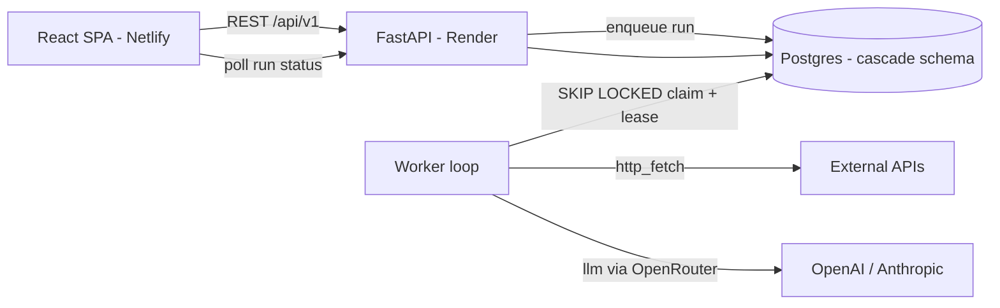
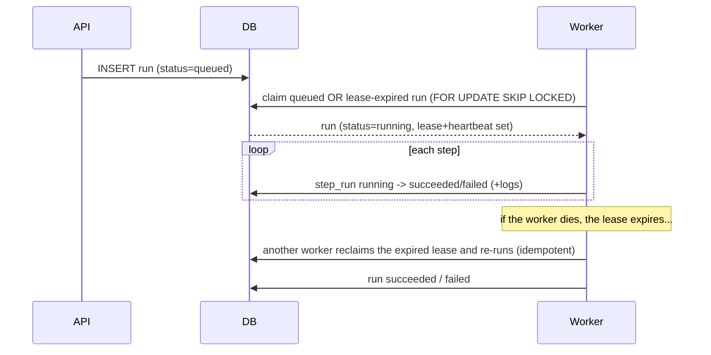

# Cascade — AI Workflow Builder

A small, production-shaped SaaS backend for building and running **AI workflows**:
users compose ordered steps (fetch an API → transform → call an LLM → branch →
output), run them as **background jobs**, and watch **live per-step logs** and
results. Multi-tenant, with bring-your-own-key LLM access.

> Built as a focused reference implementation of a "Senior Python Backend / AI
> Workflow SaaS" stack: **FastAPI · async SQLAlchemy · PostgreSQL · a crash-safe
> job worker · OpenAI/Anthropic via OpenRouter · Docker.**

**Live demo:** https://cascade-workflows.netlify.app · **API docs:** https://cascade-api-sg51.onrender.com/docs · **Repo:** https://github.com/claygeo/cascade

> The API runs on Render's free tier and **spins down after ~15 min idle**, so the
> first request (and the landing page's first "Run sample") can take ~30–50s to wake.

---

## What it does

- **Visual workflow builder** — order steps, configure each as JSON, reference
  earlier steps with `{{ steps.fetch.output.body.title }}` templating.
- **Five step types** — `http_fetch`, `llm`, `transform`, `conditional`, `output`.
- **Background execution** — enqueuing a run inserts a row; a separate worker
  claims and executes it, streaming per-step status + logs the UI polls live.
- **Try it with no signup** — the landing page runs a seeded sample workflow
  (top Hacker News story → LLM hot-take) on a rate-limited shared key.
- **BYOK** — bring your own OpenRouter key; it's encrypted at rest (Fernet) and
  never logged or returned.

## How it maps to the spec

| Requirement | Where it lives |
| --- | --- |
| User accounts | Hand-rolled JWT auth — argon2id hashing, short-lived access tokens, rotating hashed refresh tokens (`app/api/auth.py`, `app/core/security.py`) |
| Permissions | Orgs + memberships with `owner/editor/viewer`, enforced server-side on every request; tenant scope is never client-trusted (`app/api/deps.py`) |
| Workflow configuration | `workflows` + `workflow_steps`, validated step graphs (`app/api/workflows.py`) |
| API integrations | `http_fetch` step calls external APIs with timeouts (`app/services/engine.py`) |
| Job execution / background jobs | Postgres-backed queue + a separate worker using `SELECT … FOR UPDATE SKIP LOCKED`, leases, heartbeats, retries (`app/worker/`) |
| Logging | Structured per-step logs + run telemetry; secret-redacting structlog (`app/services/runner.py`, `app/logging_config.py`) |
| OpenAI / Anthropic API calls | One provider-agnostic adapter reaching both via OpenRouter (`app/services/llm.py`) |
| PostgreSQL | async SQLAlchemy 2.0 + asyncpg, isolated in a `cascade` schema, Alembic migrations |
| Docker | `backend/Dockerfile`, `docker-compose.yml` (full local stack) |
| SaaS architecture | Layered api / services / worker / models; multi-tenant; 12-factor config |

## Architecture



Run lifecycle (crash-safe):



**The interesting part — crash safety.** A run carries `claimed_by`,
`lease_expires_at`, `heartbeat_at`, and `attempts`. The claim query grabs either
a `queued` run *or* a `running` run whose lease has expired. So if a worker is
killed mid-run, another reclaims it and re-executes from a clean slate (prior
`step_runs` are cleared — execution is idempotent). This is covered by a
deterministic test: `tests/test_integration.py::test_crash_recovery_reclaims_expired_lease`.

## Tech stack

FastAPI · SQLAlchemy 2.0 (async) + asyncpg · Alembic · Pydantic v2 · PyJWT ·
argon2-cffi · cryptography (Fernet) · httpx · structlog · pytest — React 18 +
Vite + TypeScript — Docker — Postgres (Supabase) — Render — Netlify.

## Run it locally

### Full stack with Docker (one command)

```bash
export OPENROUTER_API_KEY=sk-or-...      # optional; needed for LLM steps
docker compose up --build
# API:  http://localhost:8000/docs
```

Compose runs Postgres, applies migrations, and starts the API **and a separate
worker process** (the production topology).

### Backend without Docker

```bash
cd backend
python -m venv .venv && . .venv/Scripts/activate   # or source .venv/bin/activate
pip install -r requirements-dev.txt
cp .env.example .env                                # fill DATABASE_URL, JWT_SECRET, FERNET_KEY
alembic upgrade head
uvicorn app.main:app --reload                       # API
python -m app.worker                                # worker (separate shell)
```

### Frontend

```bash
cd frontend
npm install
npm run dev      # http://localhost:5173, proxies /api -> :8000
```

## Tests

```bash
cd backend
pytest                                   # unit tests (no DB needed)
RUN_DB_TESTS=1 DATABASE_URL=postgresql+asyncpg://... pytest   # + integration & crash-recovery
```

Unit tests cover the step executors, templating, auth, and crypto. Integration
tests cover the auth flow, end-to-end run execution, cross-tenant isolation, and
the worker crash-recovery path.

## Deployment

- **API** → Render (Docker). Start command migrates then serves. On the free
  tier the worker runs **in-process** (`RUN_WORKER_IN_PROCESS=true`); a dedicated
  worker service is documented in `render.yaml` for production.
- **Database** → Supabase Postgres (the app lives in its own `cascade` schema).
- **Frontend** → Netlify (`netlify.toml`); set `VITE_API_BASE` to the API origin.

## Security notes

- Passwords hashed with **argon2id**; refresh tokens stored as SHA-256 hashes and
  rotated (single-use) on refresh.
- BYOK provider keys encrypted with **Fernet**; only a `last4` is ever surfaced.
- Tenant scope derived server-side from the authenticated user's membership —
  a client cannot act on an org it doesn't belong to.
- LLM/provider logic is confined to the services layer; a structlog processor
  redacts anything that looks like a secret; all outbound calls have timeouts.
- The public sample endpoint is per-IP rate-limited with a hard token cap.

## Known tradeoffs (demo scope)

- **In-process worker on free Render** keeps the demo at $0; production should run
  the dedicated worker service (see `render.yaml`). Free web services also cold-start.
- **In-memory rate limiter** is per-instance; a multi-instance deploy would back
  it with Redis or a Postgres counter.
- **Polling** drives live updates (simple + robust); SSE/WebSockets would cut latency.

## Project structure

```
backend/
  app/
    api/            # routers: auth, orgs, workflows, runs, keys, public
    core/           # security (jwt/argon2), crypto (Fernet)
    services/       # engine (step executors), runner, llm, templating, rate_limit
    worker/         # crash-safe claim loop (SKIP LOCKED + lease + heartbeat)
    models.py  config.py  db.py  schemas.py  seed.py
  migrations/       # Alembic
  tests/            # unit + integration
frontend/           # Vite + React + TypeScript SPA
docker-compose.yml  render.yaml  netlify.toml
```
